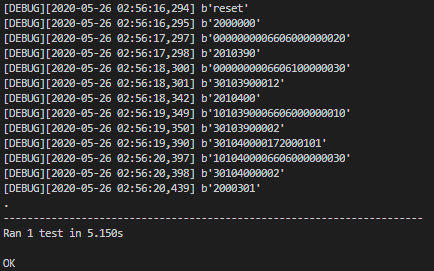
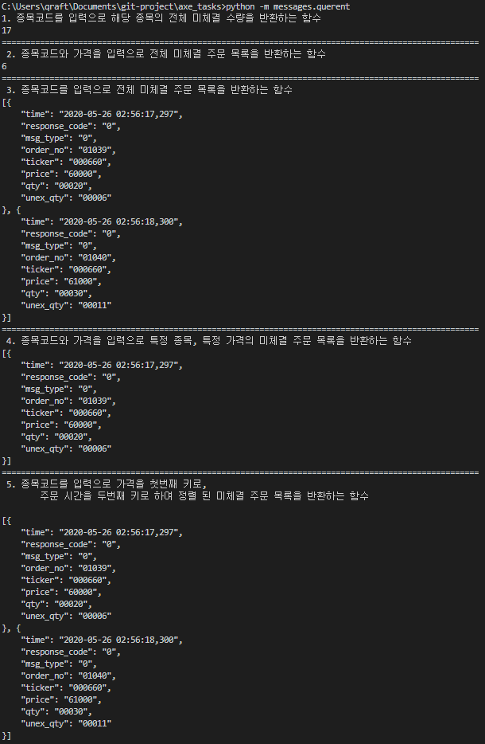

# [AXE Task] Stock Account


## Test Senario Preview
``` linux
git pull https://github.com/DonghyungKo/axe_tasks.git
cd axe_tasks
python -m test
```



## Task Requirements Preview
``` python
git pull https://github.com/DonghyungKo/axe_tasks.git
cd axe_tasks
python -m messages.querent
```



---

## [1st Feeback] Enhancement

#### [[Closed] Minor changes](https://github.com/DonghyungKo/axe_tasks/issues/4)

1. LoggerBuilder에 level parameter 수정

2. TCPSocket.sendall() 에서 flag가 필요 없음

3. TCPScoket 연결 상태 유지

4. msg_type get() 이슈

5. result.reverse() 


### [[Closed] 패킷 히스토리 메모리에 올리기](https://github.com/DonghyungKo/axe_tasks/issues/3)
> 지금은 파일로 관리, 오버헤드가 너무 심함
패킷 히스토리를 메모리 위로 올리기

### [[Closed] 주문 실패 시, 다시 주문을 제출하도록 수정](https://github.com/DonghyungKo/axe_tasks/issues/5)

> 취소 주문의 경우, qty를 입력해야 하는데 실시간으로 정확한 qty를 확인하기 어려움
>
> 따라서, 취소 주문은 주문 실패 시에 qty를 재확인하도록 수정해줘야함

### [MessageQuerent 자료 구조 개선](https://github.com/DonghyungKo/axe_tasks/issues/6)
> 지금은 모든 주문을 list에 담아서 전부 검사하고 있음
> 
> 따라서, 주문 클래스를 담는 자료구조를 개선하여 복잡도를 낮추는 형태로 최적화